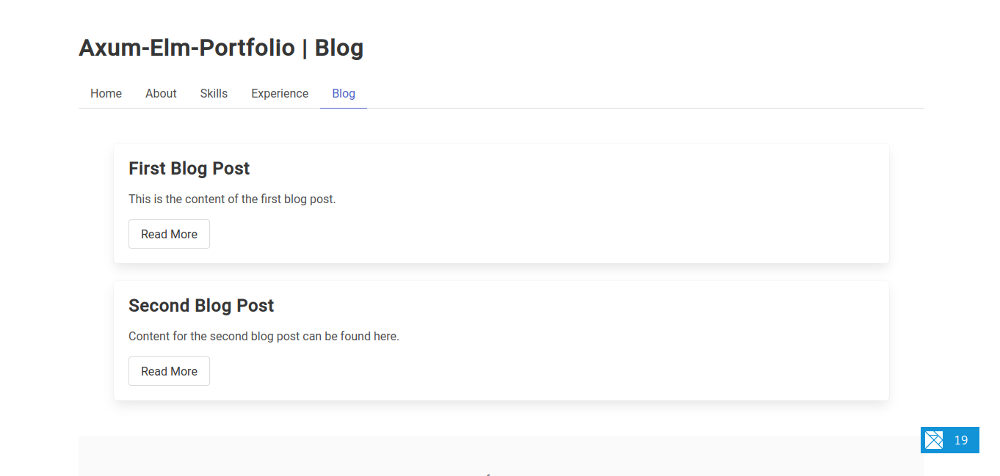
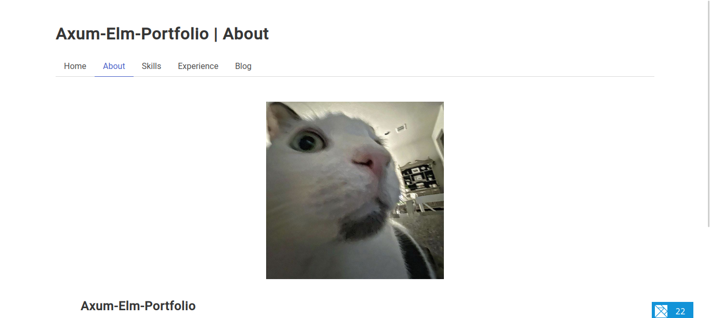

Crud App Portfolio
=================

This is a portfolio project that demonstrates a CRUD (Create, Read, Update, Delete) app built using Elm and Axum, with a Postgres database and psql. The app also includes a blog.

Getting Started
---------------

To get started with the app, you can either run it manually or use one of the provided start scripts.

### Running with start scripts

To run the app using a start script, navigate to the project directory and run one of the following commands:

* `./backend/scripts/start.sh` - This will start the app in development mode, using a local Postgres database.
* `./backend/scripts/start-docker.sh` - This will start the app in a Docker container, using a Postgres database running in a separate container.

App Functionality
-----------------

The app allows you to create, read, update, and delete blog posts. It also includes a blog that displays a list of all posts and allows you to view individual posts.

Technologies Used
-----------------

* Elm - A functional programming language for building web apps
* Axum - A web framework for Rust, used to build the server
* Postgres - A powerful, open-source object-relational database system
* psql - A command-line interface for Postgres
* sqlx

Contributing
------------

If you would like to contribute to this project, please open a pull request or submit an issue.

License
-------

This project is licensed under the MIT License - see the [LICENSE](LICENSE) file for details.
